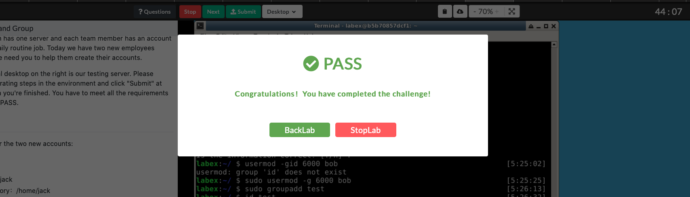
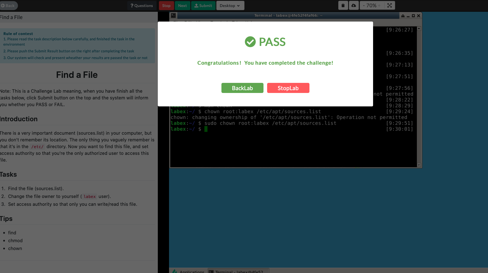
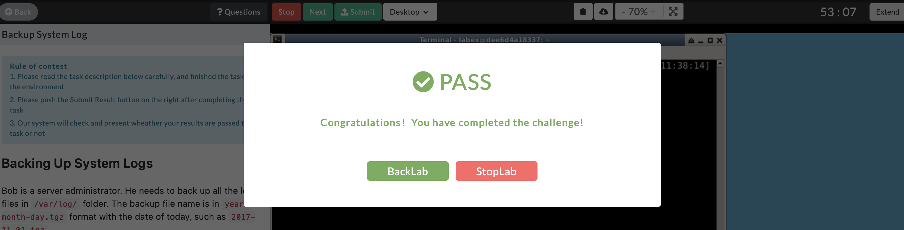
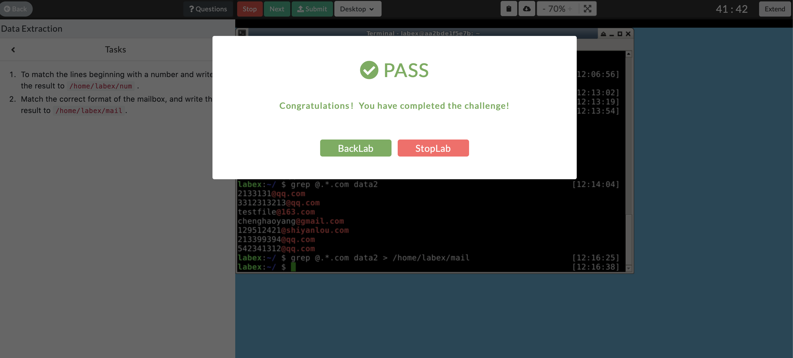

# Isaac's HW 7/16

## Add New User and Group

Used [this](https://linuxize.com/post/how-to-create-users-in-linux-using-the-useradd-command/)
page to find the commands I'd need to create a user using the `useradd` command. And after creating a user with
some of the attributes the challenge was asking for, I used
[this](https://www.tecmint.com/usermod-command-examples/) page to see how to use
`usermod` to modify the user with the remaining attributes the challenge asked for.
I followed the same procedure for groups using `groupmod` and `groupadd` with
[this](https://linuxize.com/post/how-to-create-groups-in-linux/) page.
## Find a File

I used the find command that we learned to use for our activity in class. I used `chmod` to change the permissions of the file similarly to how we did in class and then I used the `chown` command to change the file owner.

## Backup System Log

I used [this](https://www.geeksforgeeks.org/date-command-linux-examples/) link to show me how to format dates. Using the commands I found, I extracted the day, month, and
year individually, put dashes in between them and created a tar file with the name
using `tar -czvf file.tar.gz directory` where that stitched up string was in
place of `file.tar.gz`.
## Data Extraction

I used a regex to first see if it started with a number. I tested my regex out
using this [regex tester](https://www.regextester.com) website. I then created
another regex where I tested that an `@` symbol was used in the line followed by
any number of letters followed by a `.com` which was able to match the needed lines.
